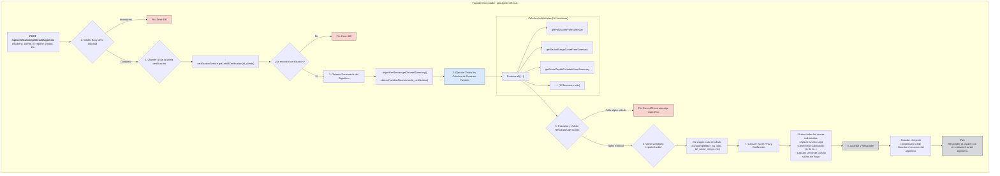

# Diagrama de Flujo: getAlgoritmoResult

Este diagrama detalla el flujo de ejecución del método `getAlgoritmoResult` que se encuentra en `src/controllers/api/certification.js`.

```mermaid
graph TD
    subgraph "Flujo del Controlador: getAlgoritmoResult"
        A["<b>POST /api/certification/getResultAlgoritmo</b><br/>Recibe id_cliente, id_reporte_credito, etc."] --> B{"1. Validar Body de la Solicitud"};
        B -- Incompleto --> C["Fin: Error 400"];

        B -- Completo --> D{"2. Obtener ID de la última certificación"};
        D --> E["- certificationService.getLastIdCertification(id_cliente)"];
        E --> F{"¿Se encontró certificación?"};
        F -- No --> G["Fin: Error 400"];

        F -- Sí --> H["3. Obtener Parámetros del Algoritmo"];
        H --> I["- algorithmService.getGeneralSummary()<br/>- obtienePartidasFinancieras(id_certification)"];

        I --> J["4. Ejecutar Todos los Cálculos de Score en Paralelo"];
        J --> K["Promise.all([...])"];

        subgraph "Cálculos Individuales (16 funciones)"
            direction LR
            K --> S1["- getPaisScoreFromSummary"];
            K --> S2["- getSectorRiesgoScoreFromSummary"];
            K --> S3["- getScoreCapitalContableFromSummary"];
            K --> S4["- ... (13 funciones más)"];
        end

        K --> L{"5. Recopilar y Validar Resultados de Scores"};
        L -- Falla algún cálculo --> M["Fin: Error 400 con mensaje específico"];

        L -- Todos exitosos --> N{"6. Construir Objeto 'reporteCredito'"};
        N --> O["- Se asigna cada resultado a una propiedad (_01_pais, _02_sector_riesgo, etc.)"];

        O --> P["7. Calcular Score Final y Calificación"];
        P --> Q["- Sumar todos los scores individuales<br/>- Aplicar función Logit<br/>- Determinar Calificación (A, B, C...)<br/>- Calcular Límite de Crédito y Días de Pago"];

        Q --> R["8. Guardar y Responder"];
        R --> S["- Guardar el reporte completo en la BD<br/>- Guardar el resumen del algoritmo"];
        S --> T["<b>Fin:</b><br/>Responder al usuario con el resultado final del algoritmo."];

    end

    style J fill:#dae8fc,stroke:#6c8ebf,stroke-width:2px;
    style R fill:#d6d8db,stroke:#333
    style T fill:#d6d8db,stroke:#333
    style M fill:#f7d4cd,stroke:#333
    style C fill:#f7d4cd,stroke:#333
    style G fill:#f7d4cd,stroke:#333
``` 